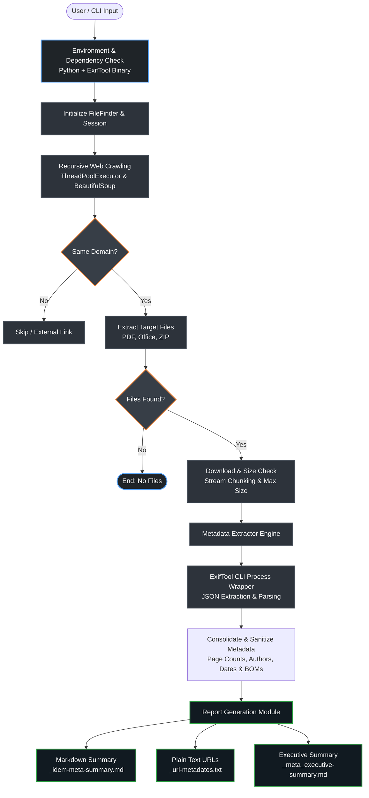

<div align="center">

# metadata 🗃️


### *Web Application File Reconnaissance & Metadata Extractor*

[](https://www.python.org/downloads/)
[](https://opensource.org/licenses/MIT)
[](https://exiftool.org/)
[](https://pypi.org/)

</div>

<br>

**metadata** is a powerful security auditing and Open Source Intelligence (OSINT) tool designed for penetration testers, security analysts, and bug hunters. It recursively crawls target domains to unearth hidden or indexed files (such as PDFs, Word documents, Excel spreadsheets, and ZIP archives), extracts deep metadata embedded within them, and automatically organizes structured executive and technical reports.

## The Concept Behind the Tool
Web applications frequently leak sensitive internal information through documents uploaded to public directories. Metadata fields (such as internal author names, software creation tools, user accounts, and structural folder paths) often provide crucial intelligence for social engineering or attack surface expansion. **metadata** automates the tedious process of discovering these files, downloading them securely, sanitizing metadata artifacts, and compiling comprehensive summaries.

## Disclaimer
> **⚠️ WARNING:** This tool is provided strictly for educational purposes, quality assurance (QA), and authorized security assessments. Unauthorized scanning, file harvesting, or extracting metadata from systems without explicit, prior written consent from the target owners is illegal. The author assumes no liability and is not responsible for any misuse or damage caused by this software. Use responsibly and ethically.

## Why Use metadata?
Metadata bridges the gap between basic web scraping and advanced metadata forensics by offering:

**Automated Deep Crawling**
- Recursively navigates same-domain links up to configurable depths using a high-performance multithreaded engine.
- Targets specific file extensions (`.pdf`, `.doc`, `.docx`, `.xls`, `.xlsx`, `.ppt`, `.pptx`, `.zip`, `.rar`) while ignoring external distractions.

**Advanced Metadata Forensics**
- Powered by **[ExifTool](https://exiftool.org/)**, enabling ultra-precise extraction of hidden metadata across dozens of enterprise file formats.
- Extracts detailed properties from **PDFs** (Page counts, Creator, Author, Title, Creation/Modify Dates).
- Parses structural and authorial data from **Microsoft Office documents** (`.docx`, `.xlsx`, `.pptx`) including internal revision numbers, software versions, applications, and corporate metadata signatures.
- Automatically sanitizes encoding artifacts (such as UTF-16 BOMs and binary prefixes) for clean report rendering.

**Structured Automated Reporting**
- Automatically organizes outputs into domain-specific directories (`domain.com_results/`).
- Generates clean plain-text URL lists (`_url-metadatos.txt`) ideal for chaining with other security tools.
- Compiles fully formatted Markdown reports containing detailed file summaries (`_idem-meta-summary.md`) and high-level analytical metrics (`_meta_executive-summary.md`).

## Architecture
Metadata connects basic web scraping with advanced forensics by offering:



## Main Features
- Fast asynchronous processing using Python's `ThreadPoolExecutor`.
- Built-in file size limits (`--max-file-size`) and download timeouts to prevent memory exhaustion on large binaries.
- Adjust thread counts, crawling depth, timeouts, or omit metadata extraction to act as a pure file finder.
- Structured execution prompts with real-time progress indicators.

## Installation
Ensure you have Python 3.8 or higher and **[ExifTool](https://exiftool.org/)**

### Install ExifTool (External Dependency)
- **Debian / Ubuntu / Kali Linux:**
  ```bash
  sudo apt update && sudo apt install libimage-exiftool-perl -y

```bash
git clone https://github.com/far00t01/metadata.git
cd metadata

// Create and activate a virtual environment
python3 -m venv venv && source venv/bin/activate

// Install required dependencies
pip install -r requirements.txt
```

## Usage
To analyze a target domain and automatically generate your executive reports and URL lists, run the main script:
```bash
python3 metadata.py
```

<br>
<br>

```bash
python3 metadata.py d@main-example.it
```


## Results
The tool generates structured, clear, and comprehensive reports categorized into technical details and executive summaries to facilitate findings analysis.

Real-time console tracking during the crawling and metadata extraction stages, displaying progress bars, discovered files, and immediate status metrics.
<br>
<br>


### Technical Report Section
Detailed breakdown of the analyzed documents and their extracted metadata parameters.
<br>
<br>

<br>
<br>

<br>
<br>


### Executive Summary Section
High-level overview of the discovery process and high-impact findings.
<br>
<br>

<br>
<br>


### URLs Text File
A clean, structured plain-text file containing the direct URLs of all files identified during the recursive web crawling phase. This inventory serves as a reliable reference list for manual auditing, secondary downloading, or feeding into other security assessment tools.
<br>
<br>


### Mitigation
If your web application publishes documents, consider implementing the following security practices to minimize information disclosure:
- Implement automated pre-upload or post-processing pipelines that strip sensitive metadata (author names, internal usernames, software versions, and local paths) from all published documents.
- Ensure documents containing internal corporate insights, draft policies, or user data are stored behind authentication barriers rather than public web-accessible directories (/wp-content/uploads/, /assets/docs/).
- Ensure that web servers (Nginx/Apache) have directory indexing explicitly turned off (autoindex off or Options -Indexes) to prevent attackers from browsing unlinked file folders.

## Author
_Developed and maintained by: Fabián Rosales_
- **Medium:** [@far00t01](https://medium.com/@far00t01/)
- **GitHub:** [far00t01](https://github.com/far00t01)
- **LinkedIn:** [frosalesr](https://linkedin.com/in/frosalesr)

#### AI Collaboration
This tool and its documentation have been iteratively developed, refined, and optimized in collaboration with **Gemini AI**, Google's advanced personal AI collaborator, ensuring clean architecture, robust error handling, and professional reporting standards.

